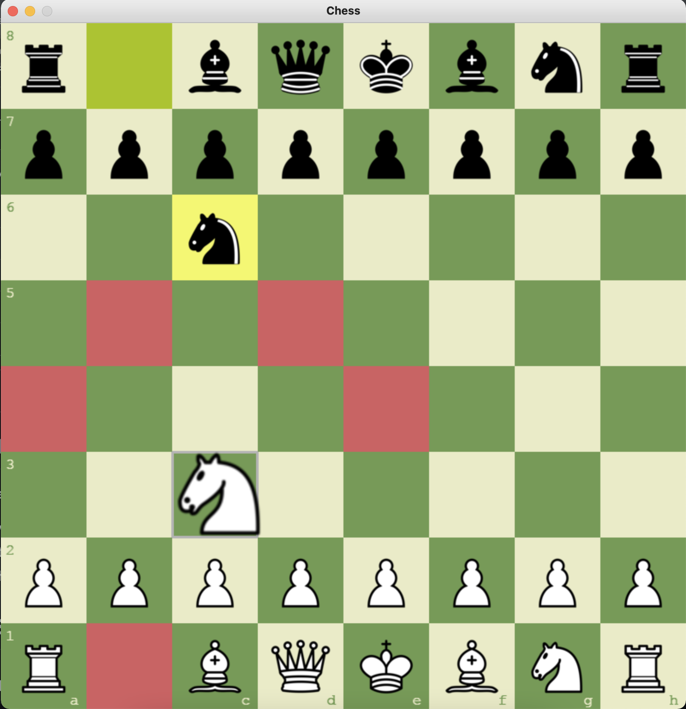

# Game Instructions

- Working on AI gamemode...

* Install dependency: `py -m pip install pygame`
* Run game: `py src/main.py`
* Press 't' to change theme (green, brown, blue, gray)
* Press 'c' to toggle Computer mode (ON by default)
* Press 'a' to switch AI algorithm (minimax / greedy)
* Press 'd' to cycle AI search depth (1/2/3)
* Press 'r' to restart the game
* On pawn promotion, click a piece in the dialog or press Q / R / B / N
* Run tests: `py -m unittest discover -s tests -v`

## Implemented Features

- Turn enforcement (white/black alternate)
- Check, checkmate, and stalemate detection
- Castling (both sides when legal)
- En passant (including one-move eligibility)
- Pawn promotion (auto-promote to queen)
- Pawn promotion selection dialog (Queen, Rook, Bishop, Knight)
- Last-move highlight and square hover outline
- Board coordinates on all themes
- Dedicated right-side panel for status, promotion choices, game-end message, and move history
- Play against computer (computer plays black in AI mode)
- Minimax AI with alpha-beta pruning (default), plus strategy-ready AI API
- Engine card with live evaluation (centipawns), depth, and searched nodes

# Game Snapshots

## Snapshot 1 - Start (green)

## Snapshot 2 - Start (brown)

## Snapshot 3 - Start (blue)

## Snapshot 4 - Start (gray)

## Snapshot 5 - Valid Moves

## Snapshot 6 - Castling

